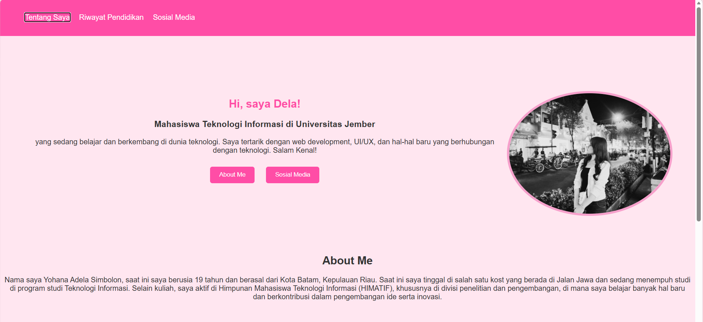
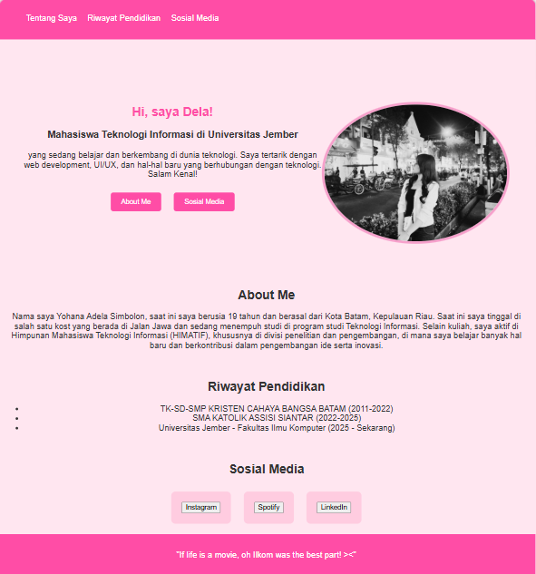
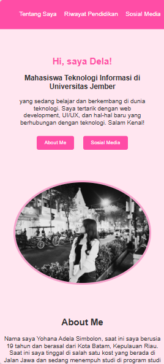

# TUGAS PWEB MEMBUAT WEBSITE (PORTOFOLIO)
Website yang saya buat ini merupakan website portofolio serderhana untuk menyelesaikan tugas Slicing Website mata kuliah Pemrograman Web. Portofolio disini menampilkan profil singkat saya sebagai mahasiswa Teknologi Informasi Universitas Jember, dilengkapi dengan riwayat pendidikan serta tautan menuju sosial media saya (ada Instagram, spotify, dan LinkedIn). Terdapat beberapa struktur pada portofolio saya ini diantaranya Hero Section yang berisi perkenalan singkat dan foto profil, "Tentang Saya" yang menjelaskan latar belakang serta aktivitas saya di HIMATIF, Riwayat Pendidikan yang menampilkan daftar sekolah dan Universitas tempat saya menempuh pendidikan, dan sosial media yang berisi tautan langsung menampilkan Instagram, Spotify, dan LinkedIn. Interaktivitas website ditambahkan melalui JavaScript DOM, misalnya alert ketika tombol ditekan dan navigasi menuju section tertentu. Website ini dibuat menggunakan HTML, CSS, dan JavaScript sesuai dengan persyaratan pada tugas yang diberikan.

## Tampilan Web

**Desktop**

**Tablet**

**Mobile**

